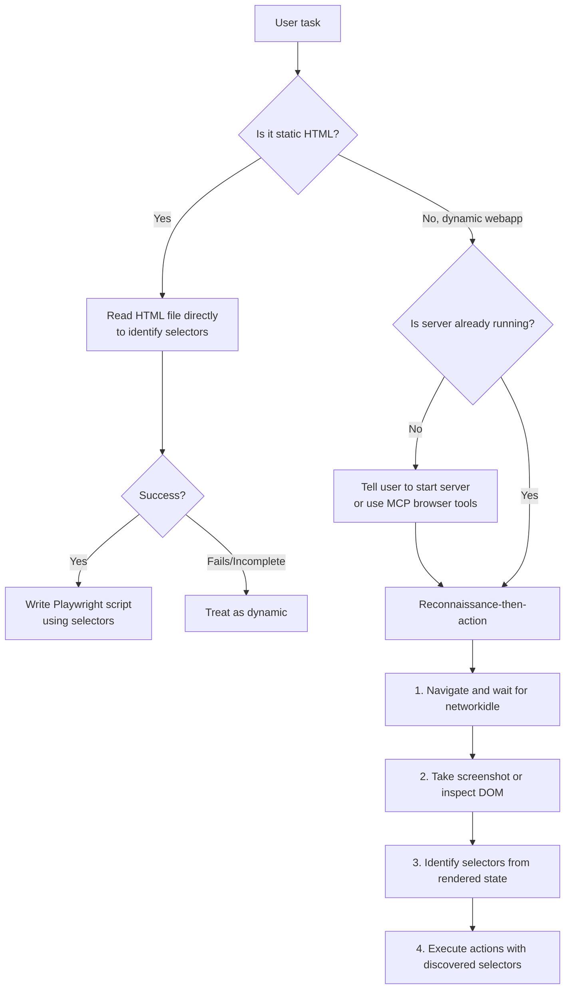

# Web Application Testing

Test local web applications by writing native Python Playwright scripts, or by using the browser MCP tools available in VS Code Copilot Chat (open_browser_page, click_element, read_page, screenshot_page, type_in_page).

This skill teaches the **reconnaissance-then-action** pattern and the **static vs dynamic decision tree**. It does not bundle any helper scripts — the agent writes Playwright code directly or uses the browser MCP tools.

## Decision Tree: Choosing Your Approach



## Two execution paths

### Path A: Native Playwright (Python)

Write a self-contained Playwright script. The agent manages server lifecycle itself — it does NOT shell out to a bundled helper. If a dev server needs to start, the user starts it in a separate terminal, or the agent uses the run_in_terminal tool.

**Single server example** (user starts `npm run dev` in a terminal first):

```python
from playwright.sync_api import sync_playwright

with sync_playwright() as p:
    browser = p.chromium.launch(headless=True)
    page = browser.new_page()
    page.goto('http://localhost:5173')
    page.wait_for_load_state('networkidle')  # CRITICAL: wait for JS to execute
    # ... your automation logic
    browser.close()
```

**Static HTML example** (no server needed):

```python
from playwright.sync_api import sync_playwright
from pathlib import Path

with sync_playwright() as p:
    browser = p.chromium.launch(headless=True)
    page = browser.new_page()
    page.goto(f'file://{Path("index.html").resolve()}')
    page.wait_for_load_state('networkidle')
    # ... your automation logic
    browser.close()
```

### Path B: Browser MCP tools (VS Code Copilot)

If the browser MCP tools are available (open_browser_page, click_element, read_page, screenshot_page, type_in_page), prefer them for interactive inspection — they require no script file and give live feedback.

```
1. open_browser_page → http://localhost:5173
2. read_page → get accessibility snapshot
3. screenshot_page → capture current state
4. click_element / type_in_page → interact
5. read_page → verify result
```

## Reconnaissance-Then-Action Pattern

1. **Inspect rendered DOM** (after waiting for networkidle):
   ```python
   page.screenshot(path='/tmp/inspect.png', full_page=True)
   content = page.content()
   page.locator('button').all()
   ```

2. **Identify selectors** from inspection results

3. **Execute actions** using discovered selectors

## Common Pitfall

**Don't** inspect the DOM before waiting for `networkidle` on dynamic apps.
**Do** wait for `page.wait_for_load_state('networkidle')` before inspection.

## Best Practices

- Use `sync_playwright()` for synchronous scripts
- Always close the browser when done
- Use descriptive selectors: `text=`, `role=`, CSS selectors, or IDs
- Add appropriate waits: `page.wait_for_selector()` or `page.wait_for_timeout()`
- If a dev server is needed, start it in a separate terminal or via run_in_terminal — do not bundle server management into the test script

## What was removed from the upstream skill

The original `webapp-testing` skill (JZKK720/oz-skills) bundled `scripts/with_server.py` to manage server lifecycle. SkillSpector blocked it at `scripts/with_server.py:69` for HIGH TM1 — tool parameter abuse (`shell=True`, which allows arbitrary command injection through user-provided `--server` arguments).

This port **removes all bundled scripts**. The agent writes native Playwright code directly or uses the browser MCP tools. Server lifecycle is the user's responsibility (start `npm run dev` in a terminal) or the agent's (via run_in_terminal), never a bundled helper that shells out with user input.

The methodology — decision tree, reconnaissance-then-action, static vs dynamic handling, common pitfalls — is preserved verbatim. Only the unsafe script execution path was removed.